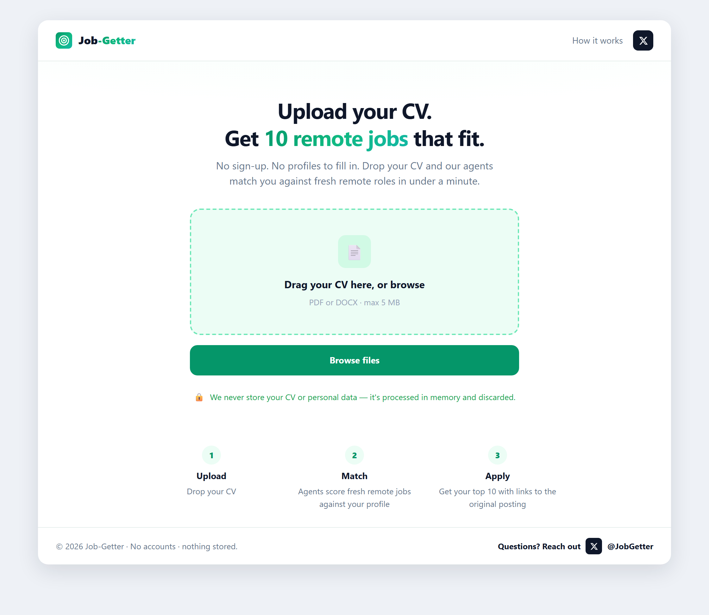
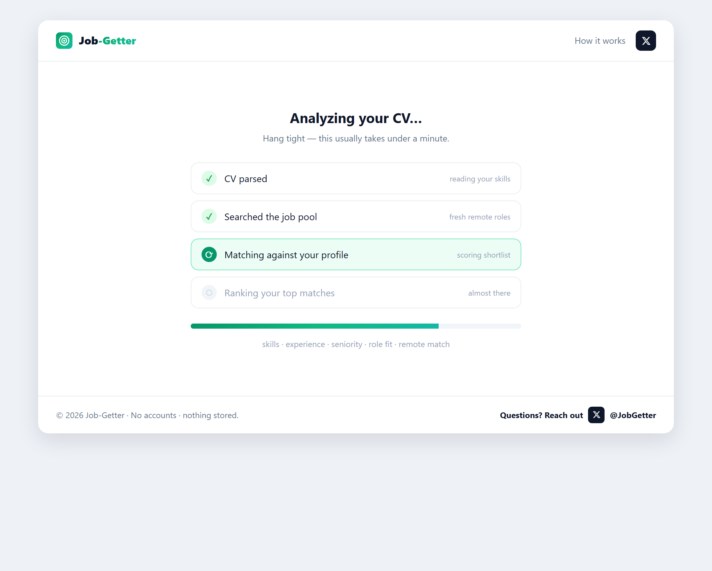
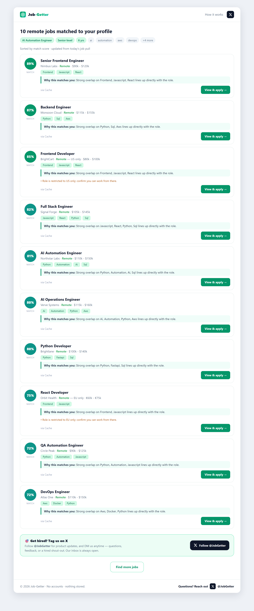

<div align="center">

# Job-Getter

### Upload your CV. Get 10 remote jobs that actually fit.

No account. No profile to fill in. No data stored.

<br />



<br />

**[Follow @JobGetter on X](https://x.com/JobGetter)** · Privacy-first remote-job matching, powered by an AI agent pipeline

</div>

---

## The problem

Job seekers waste hours scrolling job boards that were built for recruiters, not candidates. The listings are stale, the "remote" filter lies, the match is guesswork, and every promising site wants an account and a re-typed résumé before it will show you anything.

**Job-Getter flips it.** You drop in the CV you already have, and within a minute you get a short, honest list of remote roles scored against your real experience — each with a plain-English reason and a direct link to the original posting. Nothing to sign up for. Nothing kept afterwards.

---

## How it works

Three steps, under a minute, zero friction.

**1. Upload** — Drop a PDF or DOCX CV. It's read in memory and never written to disk.

**2. Match** — A pipeline of focused AI agents parses your profile, pulls fresh remote roles, and scores each one against your skills, experience, seniority, and role fit.

<div align="center">
  
</div>

**3. Apply** — Get your top matches, sorted by score, each with the skills that lined up, an honest note on any gaps, and a link straight to the source posting.

<div align="center">
  
</div>

---

## Why it's different

- **Honest matching, never padding.** If only six roles genuinely fit, you get six — not ten stuffed with noise. Weak matches are shown separately as "possible matches," clearly labelled. The app never invents a job, a salary, or an application link.
- **It tells you *why*.** Every result explains the overlap in plain language ("Strong overlap on Python, SQL, AWS") and flags real gaps ("Role is restricted to US only — confirm you can work from there").
- **Truly no account.** No sign-up, no email, no password, no profile builder. Open the page, upload, done.
- **Private by design.** Your CV is processed in memory and discarded the moment your matches are returned. Nothing is stored, logged, or sold.
- **Genuinely remote.** Roles are normalized across sources, checked for remote eligibility, and tagged with any geographic restriction up front.

---

## For investors

**Market.** Remote hiring is now permanent, and the candidate side of the market is badly served — incumbents monetize employers and treat seekers as inventory. Job-Getter is a candidate-first wedge into that gap: the fastest path from "I have a CV" to "here are jobs worth applying to."

**Differentiation.** The moat isn't the job data (that's commodity) — it's the *matching quality and the trust that comes from honesty*. Refusing to pad results, explaining every score, and storing nothing are product decisions that compound into a brand candidates actually recommend.

**Capital efficiency.** The entire MVP is engineered to run on free tiers:

| Cost center | Today | Notes |
|---|---|---|
| Job data | **$0** | Free public APIs (Jobicy, Remotive, Arbeitnow), cached and refreshed on a cron |
| Hosting | **$0** | Vercel (frontend) + Render (backend) free tiers |
| Scheduling | **$0** | GitHub Actions cron |
| LLM | **~$0** on the free Groq tier | The *only* variable cost; ≈ $0.05–0.15 per search if upgraded to a premium model |

That means the product ships and serves real users at essentially **$0 fixed cost**, with a single, legible, per-search variable cost that scales linearly and is trivial to model. Monetization (premium matching depth, saved searches, alerts, employer-side placement) sits on top of a base that costs almost nothing to keep running.

**Roadmap to revenue.** Live per-request search → richer eligibility inference → optional accounts for saved searches and alerts → premium tier → employer-side matching.

---

## Under the hood

Job-Getter is a stateless web app backed by a modular agent pipeline.

```text
CV text → CV Parser → Research → Filter → Matcher → Ranking → your matches
```

Each agent does one thing well:

- **CV Parser** extracts a structured profile (title, seniority, years, skills, tools, industries).
- **Job Researcher** pulls candidate roles from a shared, continuously-refreshed job pool.
- **Job Filter** drops anything non-remote or an obvious seniority mismatch.
- **Matcher** scores each role against a configurable weighted rubric and writes an honest reason + gap list.
- **Ranking** splits results into *strong* matches and *possible* matches — no padding.

The matching rubric is fully configurable (`backend/app/config.py`):

| Signal | Weight |
|---|---|
| Skills | 30% |
| Experience | 25% |
| Role similarity | 20% |
| Seniority | 10% |
| Education / Industry / Location | 5% each |

**AI is optional.** The parser, match explanations, and query generation use an LLM (Groq, OpenAI-compatible) when `GROQ_API_KEY` is set. With no key, the app falls back to deterministic heuristics and still runs end-to-end at $0 — so nothing is ever blocked on an API quota.

### Stack

- **Frontend:** Next.js 14 (App Router) + Tailwind CSS → Vercel
- **Backend:** FastAPI (Python 3.12), CORS-locked, rate-limited → Render
- **Job ingestion:** `ingestion/refresh_cache.py` on a GitHub Actions cron (every 8h) — pulls sources, normalizes to one schema, dedupes, writes the shared cache
- **LLM:** Groq `llama-3.3-70b-versatile` (free), upgradeable to a premium model

### Project structure

```text
Job-Getter/
├─ backend/            # FastAPI app: agents, services, models, API, tests
│  └─ app/
│     ├─ agents/       # cv_parser, job_researcher, job_filter, job_matcher, ranking
│     ├─ services/     # cv_processing, search, job_normalizer, llm
│     ├─ api/          # upload + jobs routes, schemas, responses
│     ├─ config.py     # all tunables (weights, thresholds, CORS, LLM)
│     └─ pipeline.py   # orchestrates the agents
├─ frontend/           # Next.js app (components, lib, Tailwind)
├─ ingestion/          # scheduled job-cache refresh
├─ .github/workflows/  # refresh-jobs cron
├─ data/               # shared normalized job pool
└─ docs/screenshots/   # images used in this README
```

---

## Privacy by design

- CVs are processed **in memory only** and never persisted.
- No accounts, no tracking profiles, no CV storage.
- Uploads are validated (PDF/DOCX, max 5 MB) before processing.
- CORS is locked to configured origins; API endpoints are rate-limited.
- The app never fabricates jobs, salaries, or application links.

---

## Run it locally

> Requires Node.js and Python 3.12.

**Backend**

```bash
cd backend
python -m pip install -r requirements.txt
python -m uvicorn app.main:app --host 0.0.0.0 --port 8000
```

Optional: copy `backend/.env.example` to `.env` and add a free `GROQ_API_KEY` for LLM-powered matching (works without it).

**Frontend**

```bash
cd frontend
npm install
npm run dev
```

Open **http://localhost:3000**.

**Refresh the job pool (optional)**

```bash
python ingestion/refresh_cache.py
```

### API quick reference

```bash
# health
curl http://localhost:8000/health

# analyze a CV → parsed profile + matched jobs
curl -X POST http://localhost:8000/api/analyze-cv -F "file=@/path/to/cv.pdf"

# find more jobs from an already-parsed profile
curl -X POST http://localhost:8000/api/find-jobs \
  -H "Content-Type: application/json" \
  -d '{"candidate_profile": {"professional_title":"Python Developer","skills":["python","sql"],"job_titles":["Python Developer"]}}'
```

---

## Roadmap

- Live per-request search (currently cache-fed for speed and $0 cost)
- Richer geographic-eligibility inference
- Optional accounts for saved searches, alerts, and history
- Premium matching depth
- Employer-side matching

---

## Contact

Questions, feedback, or a hired shout-out — reach us on X: **[@JobGetter](https://x.com/JobGetter)**.

## License

Currently for prototyping and demonstration purposes.
